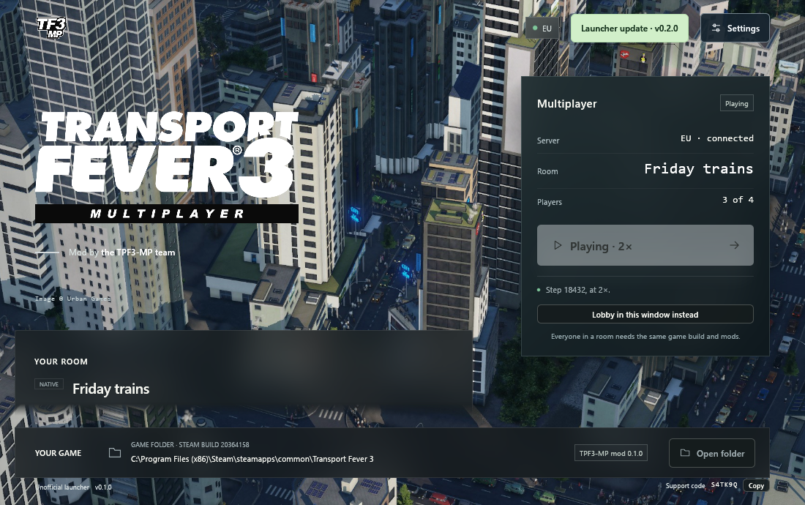

# TPF3-MP: Transport Fever 3 Multiplayer

Play Transport Fever 3 together. Build railways, run lines and grow cities
with your friends in one world, each with your own company or sharing one.

> **Coming with the game.** Transport Fever 3 comes out on 29 September
> 2026. TPF3-MP needs the finished game to hook into, so the first
> playable release follows shortly after. Watch the
> [releases](https://github.com/Juliansgith/Transport-Fever-3-Multiplayer-Mod/releases)
> page.

## What you get

- **Rooms with a six-character invite.** Create a room, send your friends
  its code (such as `K7QM2X`), and they are in. Add a password if you like.
- **No hosting, no port forwarding.** Games are held together by the
  project's server, so nobody has to leave their PC on for the others,
  and nobody sees anyone else's IP address.
- **Join a game that is already running.** Late players, and players who
  come back after a crash, receive the room's world and catch up.
- **Your choice of rules.** Play with the game's own economy, just as in
  single player, or with rules the server keeps, where nobody can cheat
  money into their company.
- **Chat, and a clear view of the room**: who is in, who is ready, and
  exactly which mods to add or remove when yours differ from the room's.
- **A launcher that looks after itself.** It updates itself, installing
  only releases the project signed, and you can pick the Stable or
  Experimental track, or an earlier version, in its Settings.

## What you need

- **Transport Fever 3** on Steam, and Steam running.
- **Windows 10 or 11** (64-bit). Linux follows after the first release,
  then macOS.
- Everyone in a room needs the same game version and the same mods; the
  launcher tells you what to change.

## Getting started

1. **Download** the latest TPF3-MP for your system from the
   [releases](https://github.com/Juliansgith/Transport-Fever-3-Multiplayer-Mod/releases)
   page, and unpack it somewhere you can write to, such as your Documents
   folder.
2. **Install the mod:** double-click `INSTALL_TPF3MP.cmd`. It is a script
   you can open and read, and it only puts the TPF3-MP mod in your mods
   folder. Then start the game once, open **Mod Hub**, and **Activate**
   TPF3-MP.
3. **Start the launcher**, `TPF3-MP.exe`. The first time, Windows may warn
   about an unknown app: choose **More info**, then **Run anyway**.
4. **Start Transport Fever 3 from the launcher.**
5. **Click Multiplayer** on the game's main menu: connect with the name
   others will see, then **create a room** from one of your saves and send
   the invite, or **join** with the invite a friend sent you. You are
   ready by yourself; play once the room's owner starts the game.

Only a game the launcher starts joins the room; started from Steam,
Transport Fever 3 is the plain game, with nothing of TPF3-MP in it.

The full player's guide, with what to do when something does not work,
is in [docs/PLAYING.md](docs/PLAYING.md).

## Getting help

- The launcher shows your **support code** at the bottom. Quote it when you
  ask for help: it lets the server's operator find what went wrong for
  you, and it lets nobody into your room, so it is safe to post.
- Report problems in the
  [issues](https://github.com/Juliansgith/Transport-Fever-3-Multiplayer-Mod/issues).
- While you are connected, the launcher sends its log to the server, with
  your paths, codes and addresses taken out, so there are no files to
  send. You can turn this off in **Settings**.

## Credits

- The launcher is **tearded's TPF2 Multiplayer Launcher**, brought to
  Transport Fever 3.
- TPF3-MP builds on two Transport Fever 2 multiplayer mods by its team:
  **TPF2MP** by _Sep and **TpF2 Multiplayer** by silver2127.
- The city in the launcher is a Transport Fever 2 screenshot, and the
  logo is Transport Fever 3's, both © Urban Games, used under their
  fan-content terms.

TPF3-MP is an unofficial fan project, not made or endorsed by Urban Games
or Paradox Interactive. It does not redistribute any part of Transport
Fever 3.

## For developers and server operators

How it works, where it stands and how to build it:
[docs/DEVELOPMENT.md](docs/DEVELOPMENT.md). Running a server:
[docs/OPERATIONS.md](docs/OPERATIONS.md). How changes are made and
released: [AGENTS.md](AGENTS.md).

## License

MIT; see [LICENSE](LICENSE).
